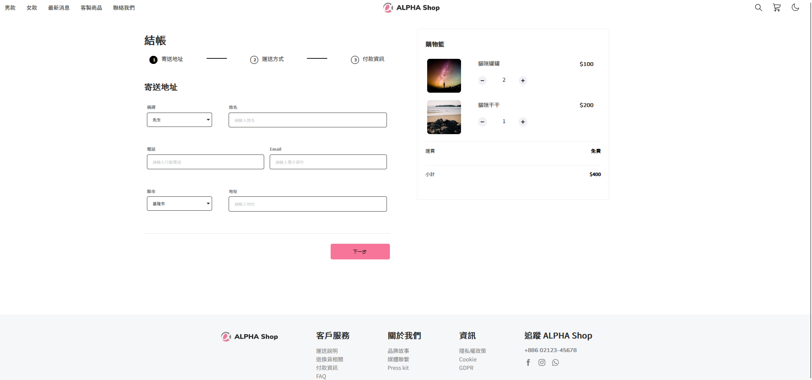
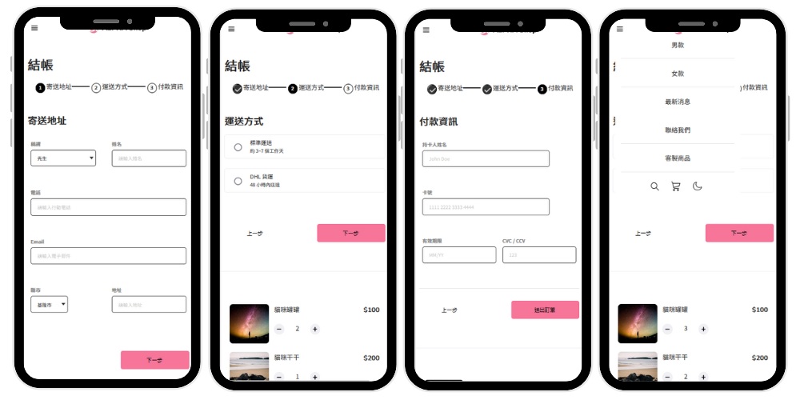

# Alpha-Shop

[專案頁面連結](https://yuri1022.github.io/alpha-shop-C4/)





## 專案介紹

此專案為 Alpha Camp 學期挑戰，使用 React 打造出 Alpha Shop 一頁式購物車介面。介面以 480px 為分界點，共分為五大 Component：Navbar、Stepper、Form、Cart、Footer。

## 功能描述

1. **Navbar**：在小螢幕會收縮成漢堡排。
2. **Stepper**：標示「寄送地址、運送方式、付款資訊」三個操作階段。
3. **Form**：「寄送地址、運送方式、付款資訊」各自有對應表單，透過「上一步」和「下一步」按鈕切換。
4. **Cart**：顯示有兩件商品的照片、單價、運費和總價。
5. **Footer**：在手機版不顯示。

## 開發工具

- React.js
- SCSS

## 專案安裝與執行步驟

1. 打開終端機並 Clone 此專案到本地電腦。
```
git clone https://github.com/yuri1022/alpha-shop-C4
```

2. 使用終端機進入此專案資料夾：alpha-shop-C4。

```
cd alpha-shop-C4
```
3. 使用終端機安裝。

```
npm install
```

4. 啟動

```
npm run dev
```

5. 打開任一瀏覽器輸入此網址即可瀏覽網頁。

```
http://localhost:3030/alpha-shop-C4
```

## 專案開發人員

Elaine Huang
